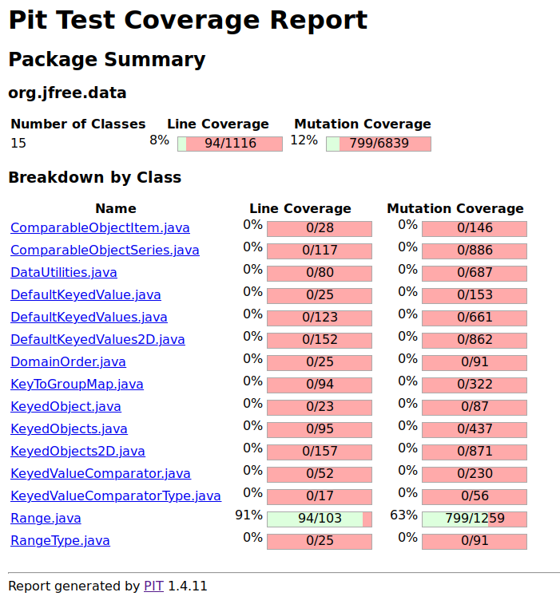
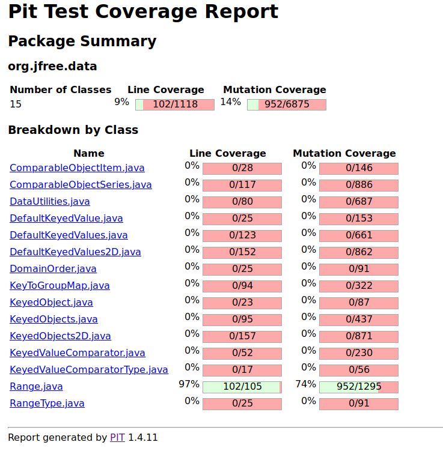
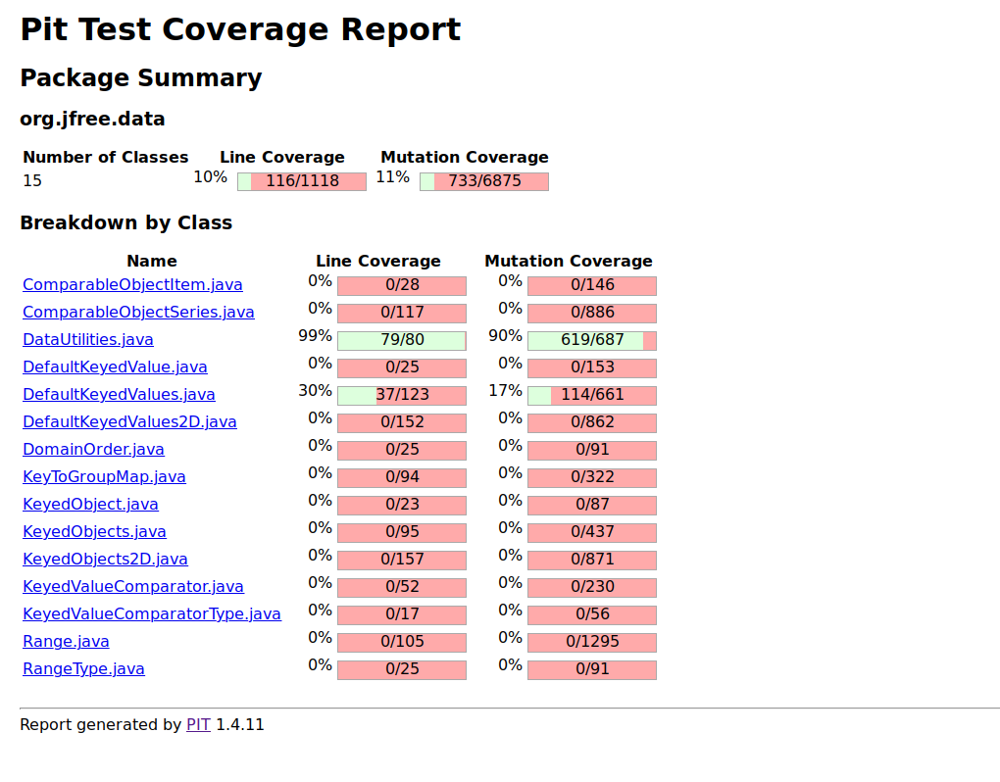
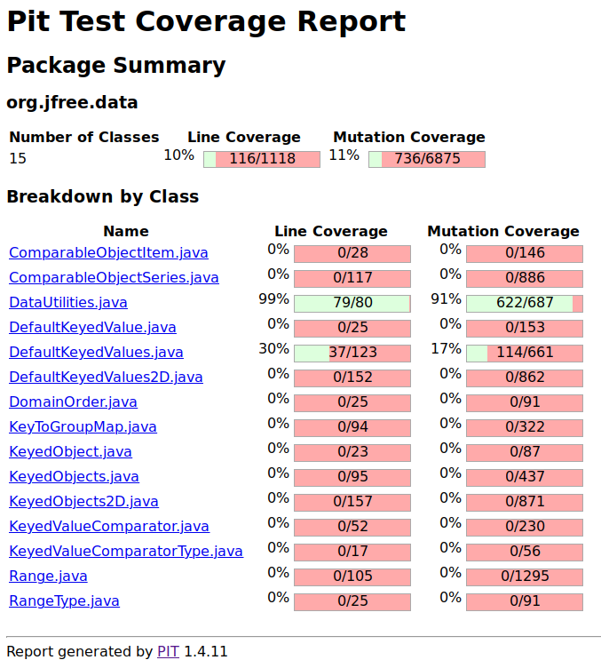
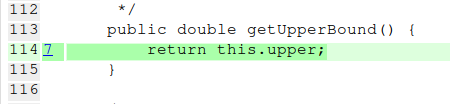
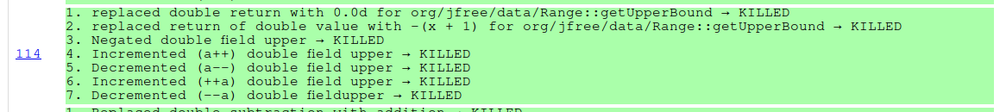
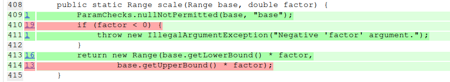
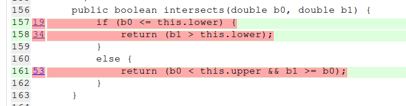

**SENG 637- Dependability and Reliability of Software Systems**

**Lab. Report \#4 – Mutation Testing and Web app testing**

| Group \#:              | 16  |
|------------------------|-----|
| Shahryar Soltanpour    |     |
| Mohammad Reza Kianifar |     |
| Muhammad Raihan        |     |

# Introduction

# Link of demo video

[Video Link](TODO://add-here-the-link-of-the-video)

It works for everyone with logged-in university account on outlook.
Please [tell us](mailto:mohammadreza.kianifa@ucalgary.ca) if you had any problem.\

# Analysis of 10 Mutants of the Range class

| Method                                                                                                       | Mutation                                                                                   | Analysis                                                                                                                                                                                                                                                                      |
|--------------------------------------------------------------------------------------------------------------|--------------------------------------------------------------------------------------------|-------------------------------------------------------------------------------------------------------------------------------------------------------------------------------------------------------------------------------------------------------------------------------|
| getUpperBound()                                                                                              | Negated double field upper → KILLED                                                        | Instead of returning this.upper, it returns -this.upper. Because we had plenty of tests that used the Range(-0.5, 0.5), when we negate the upper bound, and we check the contains method for value 0, the result changes from true to false, and the test fails.              |
| getLowerBound()                                                                                              | Incremented (a++) double field upper → KILLED                                              | Instead of returning this.lower, it returns this.lower+1. So for the Range(-0.5, 0.5), the range becomes Range(0.5, 0.5) and the contains(0) result will change from true to false, and the test fails.                                                                       | 
| getLength()                                                                                                  | Replaced double subtraction with addition → KILLED                                         | Instead of returning this.upper-this.lower, it returns this.upper+this.lower. So the length for Range(-2, -0.5) would be -2.5 instead of 1.5 and our tests that check method this will fail.                                                                                  |
| getLength()                                                                                                  | replaced double return with 0.0d for org/jfree/data/Range::getLength → KILLED              | Instead of returning this.upper-this.lower, it returns 0. So the length for Range(-2, -0.5) would be 0 instead of 1.5 and our tests that check method this will fail.                                                                                                         |
| getLength()                                                                                                  | replaced return of double value with -(x + 1) for org/jfree/data/Range::getLength → KILLED | Instead of returning this.upper-this.lower, it returns -(this.upper-this.lower)-1. So the length for Range(-2, -0.5) would be -2.5 instead of 0.5 and our tests that check method this will fail.                                                                             |
| getLength()                                                                                                  | Replaced double subtraction with multiplication → KILLED                                   | Instead of returning this.upper-this.lower, it returns this.upper*this.lower. So the length for Range(-2, -0.5) would be 1 instead of 0.5 and our tests that check method this will fail.                                                                                     |
| combine(Range range1, Range range2)   if (range1 == null)                                                 | negated conditional → KILLED                                                               | Instead of checking (range1 == null) it checks !(range1 == null). We had a test that passed range1(-1, 0), range2(0, 1) to the function, and the result should be Range(-1, 1). But now because the if condition is true, it will return range2 as result and the test fails. |
| combine(Range range1, Range range2)   if (range1 == null)                                                 | removed conditional - replaced equality check with false → KILLED                          | Instead of checking (range1 == null) it's always false. We had a test that passed range1 as null and range2(0, 1) to the function, and the result should be range2. But now the code raise NullPointerException and fails.                                                    |
| expand(Range range, double lowerMargin, double upperMargin) ParamChecks.nullNotPermitted(range, "range"); | removed call to org/jfree/chart/util/ParamChecks::nullNotPermitted → KILLED                | It removes this line. We had a test that passed range=null to the function, and expected IllegalArgumentException but now it doesn't  work and code raises NullPointerException.                                                                                              |  
| expand(Range range, double lowerMargin, double upperMargin) upper = lower;                                | Negated double local variable → KILLED                                                     | Instead of assigning lower to upper, it assigns -lower to upper. So the final Range changes. We had a test that we finally expected Range(-3, 3), but now we receive Range(-3, -3), and the test fails.                                                                       |  
 
# Report all the statistics and the mutation score for each test class

This is how Range class score was initially (63%):

This is the Range class after improvement (74%):

Also, this is how DataUtilities score was initially (90%):

And finally, this is how DataUtilities score became after all **possible** improvements (91%):

# Analysis drawn on the effectiveness of each of the test classes

For the Range class, first, we had the mutation score of 63%, and finally, it was improved to 73%. We added new test
cases for some of the exiting class, like _combineIgnoringNaN(), constrain(), scale(), intersect(), expandToInclude()_,
and _constructor()_. These cases were added in a way to kill the survived mutation that we will describe in more detail
in the next sections. Also, some new test cases were designed for not-tested methods like _toString() or hashCode()_.
Because they used some constant value and plenty of mutations happened to them that we could not kill them with our
existing tests.

For DataUtilities class, the initial mutation coverage was 90% (619 out of 687). After reading mutation summary report of our tool, we've found out that in some cases, the removal of calling `ParamChecks.nullNotPermitted` mutations are not covered. Therefore, we wrote new tests and passed null as the argument to cover these mutations. Then the achieved mutation coverage was 91% (622 out of 687).  
But as we will explain in the next part, the remaining mutants were equivalent mutants so it was impossible to remove them. 

The tests are developed in separated files to increase the clean code and multitasking in the group. You can run the
tests related to _Range_ class by running the _RangeJunitTestSuite_ class, and tests related to _DataUtilities_ class by
running the _DataUtilitiesJunitTestSuite_ class.

# A discussion on the effect of equivalent mutants on mutation score accuracy
There are some types of mutations that do not change the behaviour of the code. Therefore, when you apply the mutation, the code is changed but the functionality is exactly the same. These types of mutants are called equivalent mutants.

The problem is that these types of mutations are counted when we want to calculate the mutant coverage and can reduce the percentage of mutants covered. In the case of this project, we have achieved 90% mutant coverage for the Data Utilities class, but we couldn't increase it since all the remaining are equivalent mutants. 
Here are some examples of what couldn't be changed in the code: 
- `for (int v = 0; v < validRows.length; v++)` changing less than condition to not equal makes no difference in the execution of the loop and is equivalent mutant.
- Changing `Number n = data.getValue(r, column);` to `Number n = data.getValue(r, column)++;` makes no difference. Since the value is assigned to n before incrementing and the incremented part is not saved anywhere in the memory. So this is an equivalent mutant as well.

# A discussion of what could have been done to improve the mutation score of the test suites
First, we analyze the generated report by the mutation tool. It shows you a detailed report for each line. For instance,
by looking at the below picture, you can see that for _getUpperBound()_ method of the class _Range_ we had full mutation
coverage because it is highlighted in green.

If we click on the number on the right side of the line number, we can go to detailed info about the applied mutations,
which you can see in the picture below:

For some methods that we don't have full coverage of, the line is highlighted in red color. In these cases, at least one
of the mutations has survived. We went through all the red lines and analyzed the survived mutation. We designed new
test cases in a way to kill these survived mutations if it's possible. (Because killing all the mutations is not
feasible.)

For instance, we saw the bellow picture when we first ran the tool on our code:

You can see that in line 410, the if condition is not fully killed on mutations. One of the mutations was replacing the
0 with 1. And our correct test case passed the factor = 2 to the function. So by replacing 0 with one, none of our test
cases failed. So we added a new test case that passed factor = 0.5 to the function. After that, the mutation was killed,
and our mutation score was improved. Also, one of the mutations was replacing the zero with -1, so we added another test
with factor -0.5 that except an exception to be thrown. So we could kill this mutation too. Our old test for failing
used the factor = -2.

Another example of improving the mutation score was adding marginal test cases.

For instance for intersects function, one of the reasons for survived mutation for line 157, was replacing less or equal
to the operator with less than. By adding tests with marginal values, like Range(1, 2) and b0=1, b1=2, we could kill
these mutations. We used this technique for plenty of other methods like expandToInclude and combineIgnoringNaN as well.

Another example is for line removal, for instance in DataUtilities class, there is a null assertion at the beginning of
the tests, like calculateColumnTotal or calculateRowTotal. We added a new test that passes the data as null, and expect
IllegalArgumentException. Now by removing the null-assertion line due to mutation, this test will fail.

Our next example is improving the mutation score with constant values. For instance, when the Range constructor throws
an exception when the lower bound is greater than the upper bound. In the exception message, it adds the lower and upper
variables. And some mutations were related to applying operations on these variables. So by adding a new test that
checks the constant value of a message, we could kill some mutations.

# Why do we need mutation testing? Advantages and disadvantages of mutation testing
Advantages:
- It helps to find the complex bugs that are hidden during normal testing.
- Mutation testing can detect all faults in the source code.
- With mutation testing, testers could find the quality of test suites that they write.
- Sometimes both of the codes and test cases are correct but the problem is caused because of test data. Mutation testing helps to find out the issues in test data.
- High coverage of the source program is attained.
- You need to be careful about marginal values in your test cases.
- You should be careful about every single line in your source code to cover all the possible change states.
- Loopholes in test data can be identified.
- The quality of software programs has been improved.
- This method helps to find the hidden defects and maximum code coverage to identify the part of the code that is not completely tested by the primary test suites.

Disadvantages:
- Some mutations are infeasible to be killed, and it takes you plenty of time to identify them.
- Not all the mutations are things that commonly happen to the source code during the changes. So the related tests are also useless.
- This method is costly and time-consuming because many mutant programs would be produced and must be tested.
- Complex mutations are difficult to implement.
- It is not possible to do this testing without any automation tools.
- As this method involves source code changes, it is not at all applicable for Black Box Testing.
- Since each mutation has the same number of test cases as that of the original program, a large number of mutant programs may need to be tested against the original test suite.

# Explain your SELENUIM test case design process

# Explain the use of assertions and checkpoints

# how did you test each functionaity with different test data

# Discuss advantages and disadvantages of Selenium vs. Sikulix
- Sikuli Tool is used for automating based on what can be seen on-screen (GUI), whereas Selenium is used to automate testing of Web Applications.
- Selenium Uses locators (like classname or id) from HTML code to automate testing of Web Page Applications, but Sikuli uses image recognition techniques.
- Sikuli uses images for comparison and performs various operations like click, doubleClick, rightClick, text. It compares images by the percentage value comparison
- Selenium Can not automate desktop applications, whereas Sikuli can automate a Windows application.
- Selenium supports almost all modern browsers
- Selenium is Used for Regression testing
- Selenium allows you to create an automation framework using TestNG for reporting
- Sikuli might behave differently if the saved image, matches with more than one object on the screen.
- Selenium has a complicated API, whereas Sikuli has a much simpler API.
- Sikuli can be combined with Selenium to perform both browser-based and mouse clicks operations.
- Selenium cannot automate flash objects like video players, audio players, etc, whereas Sikuli provides rich support to automate flash objects.

# How the team work/effort was divided and managed

# Difficulties encountered, challenges overcome, and lessons learned

# Comments/feedback on the lab itself
